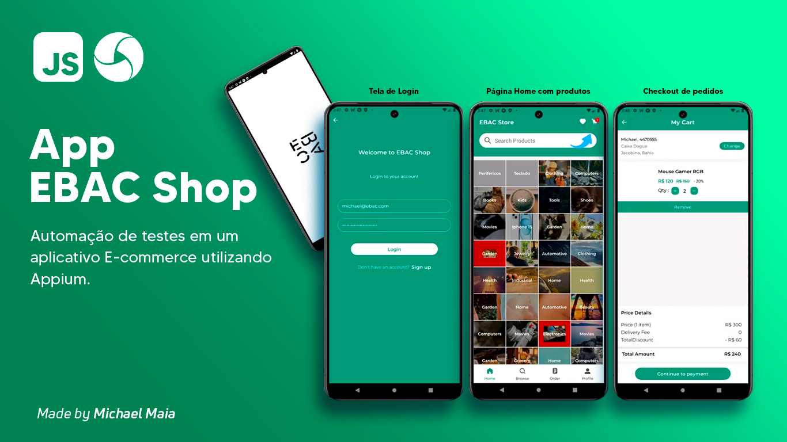

# Automação de Testes de Aplicação Mobile


Este projeto realiza a automação de testes de uma aplicação mobile, cobrindo o fluxo completo de login, seleção de produto e finalização de compra. O ambiente utiliza WebdriverIO, Appium, Allure Report e Android Studio.

## Cenários de Teste

1. **Login**
   - Realiza login com email e senha.

2. **Acessar a área de busca (Browse)**
   - Navega até a área de busca de produtos.

3. **Selecionar um produto**
   - Escolhe um produto da lista e acessa os detalhes.

4. **Adicionar o produto ao carrinho**
   - Adiciona o produto selecionado ao carrinho.

5. **Adicionar endereço de entrega**
   - Adiciona um endereço de entrega se ainda não houver nenhum cadastrado.

6. **Ir para o pagamento**
   - Navega até a página de pagamento após adicionar o produto e o endereço.

7. **Finalizar o fluxo de checkout**
   - Completa o processo de pagamento, finalizando a compra.

## Pré-requisitos

Certifique-se de que você possui as seguintes ferramentas instaladas:

- **Node.js** (versão LTS recomendada)
- **Appium**
- **Appium Inspector**
- **Android Studio**

## Instalação

1. **Instalação**

```bash
   npm install
   npm install -g appium
   npm install -g allure-commandline --save-dev
```
2. **Execução de testes**
```bash
   npm run test:android:product
```
3. **Geração de relatórios**
```bash
   allure generate allure-results --clean
   allure open
```

- **Tecnologias Utilizadas**
    - **WebdriverIO:** Framework para automação de testes.
    - **Appium:** Ferramenta de automação mobile.
    - **Allure Report:** Geração de relatórios de testes.
    - **Android Studio:** Ferramenta de desenvolvimento e emulador Android.
    - **Appium Inspector:** Inspeção de elementos mobile.

   

